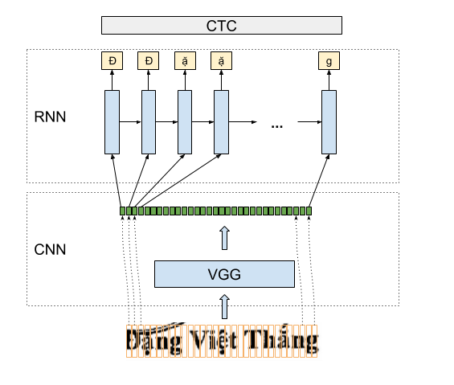

# Vietnamese Handwritten Characters Recognition - Convolution Recurrent Neural Nets
First of all, i would like to thank [Jieru Mei](https://github.com/meijieru/crnn.pytorch). My repo was heavily based on his repo.

This repo implemented convolution recurrent neural nets(CRNN) for handwritten recognition, optical character recognition. CRNN can use for many text levels: character, word, or even a text line.

In this repo, I try to provide a simple API which help everyone can train their own model. This model, which i have used for many industry projects, can guarantee to work well in many cases.



# Dataset
You must organize your dataset in the below structure
```
├── 23963.jpg
├── 23963.txt
├── char
├── test
└── train
```
Here you must put your images with it's labels in the same folder. Each image is a text line, so just put only one line of text in corresponding label file.

*train*: list of all training files <br />
*test*: list of all testing files <br />
*char*: list of all characters in labels <br />

You can look at data *folder* to see an example. 

# Training
## Training options
There are critical options which you need to modify to adapt you dataset's properties:
* imgW: should be larger than the maximun width of images in training set. All images, which have small width, will be padded in the right hand.
* imgH: should be 64 in the model since the downsampling rate is 64 pixel in vertical orientation.

## Train
Training process was simplified, just type the command in your terminal and you should use the pretrain model

```
python train.py --root {root_folder} --train train --val test --alphabet char --pretrain {pretrain_model} --imgW {your_width} --imgH 64 --pretrain expr/crnn.rnn.pth
```
To use GPU to speed up your training, just pass ``--cuda`` in options. Your trained model will be exported your `--save_model` in options. Please see the code for more options.

# Predict
To make a prediction for a new image

```
python demo.py --model {model} --alphabet {char} --imgW {width} --imgH 32 --img {img}
```
Here is a sample


Result: đđ-ặ--nngg   vvviiệệtt  tt--h--ắ--nnggg  ----> đặng việt thắng      : prob: 0.9896178245544434

# Dependences
* [warp_ctc_pytorch](https://github.com/SeanNaren/warp-ctc/tree/pytorch_bindings/pytorch_binding)

# Any Problems:
If you have any problems, please email me or create an issue.
